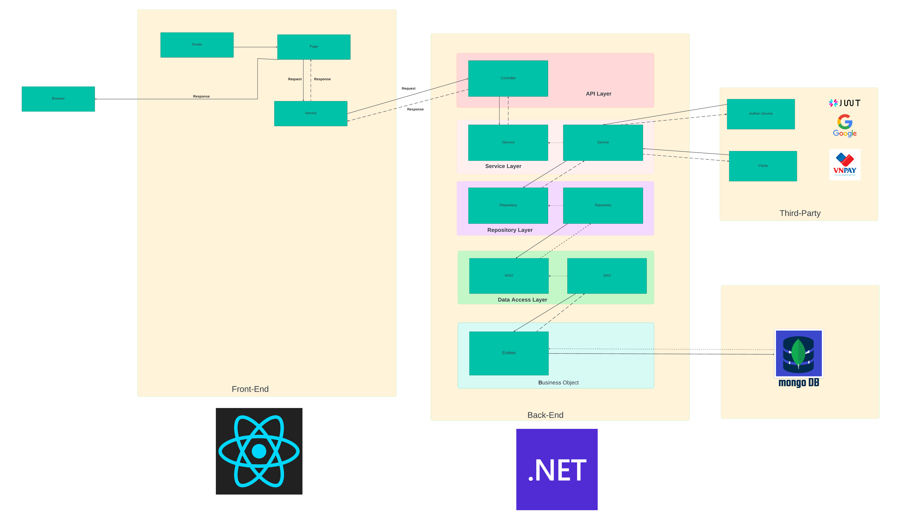

- # SWD392-HairSalon
  -  Hair Salon Booking App Web Application & Mobile
  - ### Logo
    
- # **Project Synopsis :**
  - **Class:** SWD392-SE1705-FA2024
  - **Project Supervisor:** Lam - Lam
  - **Topic:** Topic 14 (Hair Salon)
  - **Authors:**
    - Trịnh Quốc Thái - SE171697 - Rous1141 - FE | BE | Mobile
    - Huỳnh Thiện Nhân - SE171117 - Dacoband - BE | Database Desgin | Documentation
    - Trần Ánh Tuyết - SE170234 - GUI Design | FE
    - Nguyễn Minh Thức - SE170592 - Database Design | BE
    - Thảo Nguyễn - SE172937 - FE | Documentation
  - **Project:** Hair Salon Booking App - Service, E-Commerce - Business to Consumer
  - **Techs:** 
    - Back-End : RestfulAPI - .NET 8  core - ASP.NET  -  SignalR RealTime - JWT Authentication 
    - Front-End : React - TypeScript 
    - Orthers : MongoDB - CI/CD - Docker - Figma - VNPay - Hosting 
  - **Structure:** 
    - Back-End:  Using model Separation of Concerns, Code-First
    - Front-End:  
  - **System Architecture** 
    
